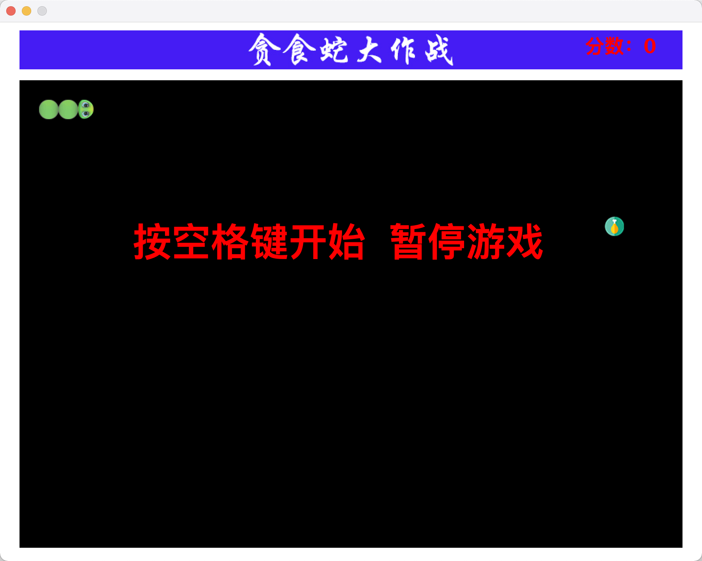
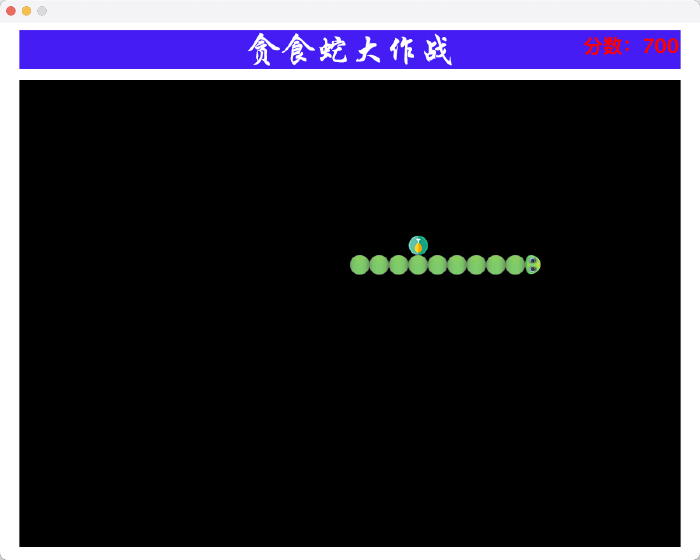
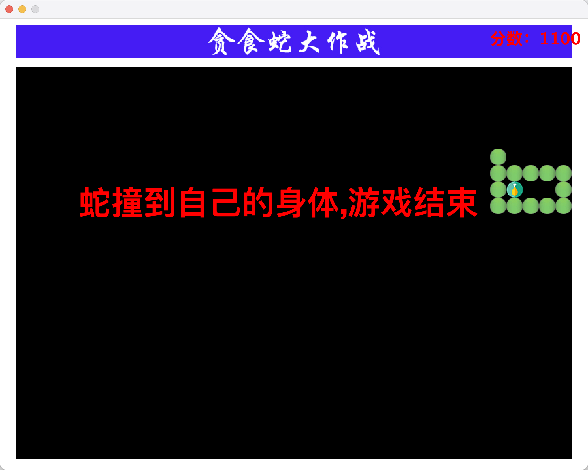

# 基于Java Swing实现的贪吃蛇

本项目在jdk1.8下测试通过。

## 怎么运行

### 命令行运行
假设现在命令行已经位于项目的根目录

1. 创建out目录，该目录存放编译好的class文件
```bash
mkdir out 
```
2. 执行下面的命令将Java文件编译并保存到out目录下

```bash
javac -d out src/**/*.java
```

2. 将资源文件拷贝到out目录下

```bash
cp -R src/resources/ out/resources
```

4. 执行如下的命令，运行class文件

```bash
java -cp out shao.GluttonousSnake
```

### 脚本运行

根目录下的run.sh文件包含了上面的命令，可以直接执行该脚本来运行项目

```bash
chmod run.sh
./run.sh
```

### IDEA中运行

直接将该项目导入idea即可

## 运行截图

### 开始界面



### 运行过程中的截图



### 游戏结束界面


